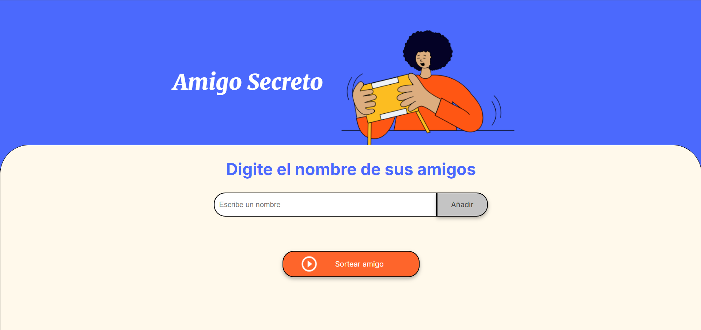
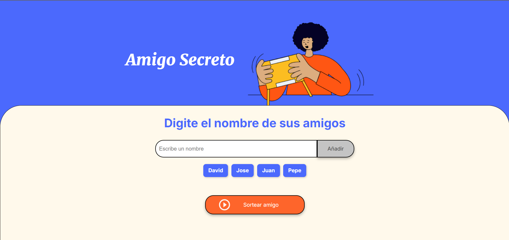
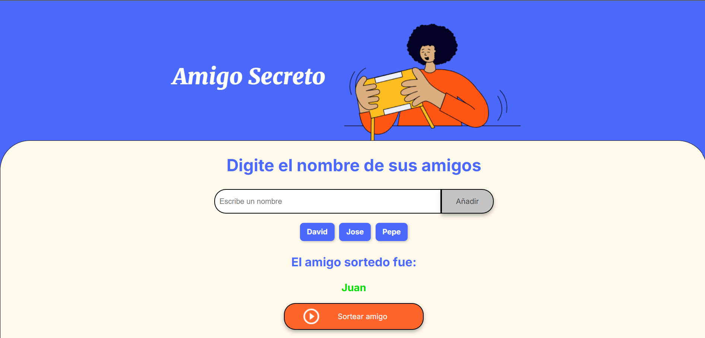

🎁 Amigo Secreto

Aplicación web interactiva para sortear un amigo secreto entre una lista de participantes.

🚀 Características

Permite agregar nombres de amigos a la lista.

Evita duplicados en la lista de participantes.

Sortea aleatoriamente un amigo de la lista.

Elimina al amigo sorteado para evitar repeticiones.

📸 Capturas de Pantalla

📜 Instalación y Uso

Clona el repositorio

git clone https://github.com/tu-usuario/amigo-secreto.git

Abre el archivo index.html en tu navegador.

1.- Agrega el nombre de un amigo en el campo de texto
2.- Presiona el botón de Añadir
3.- Una vez agregados todos los amigos presiona el boton de Sortear Amigo

🛠️ Tecnologías Utilizadas

HTML → Estructura de la aplicación.

CSS → Estilos y diseño responsivo.

JavaScript → Lógica del sorteo y manipulación del DOM.